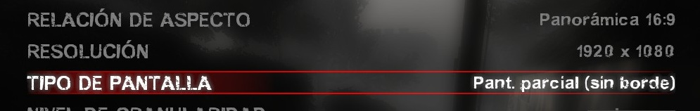
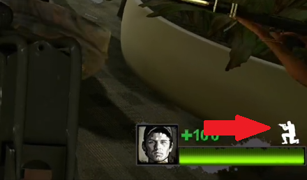
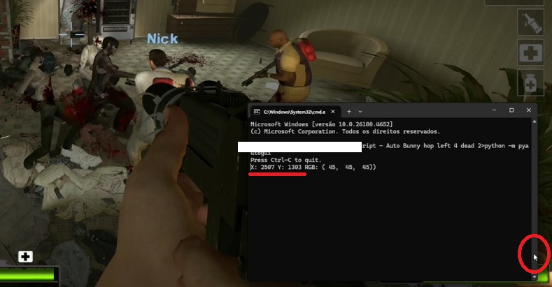

<h1 align="center">🐇 Auto Bunny Hop — Left 4 Dead 2</h1>

<p align="center">
  <em>Salta casi perfecto cada vez que te agachas, con un simple script en Python.</em>
</p>

<!-- ─────────────────────────────────── DEMO ─────────────────────────────────── -->
<p align="center">
  
</p>

---

## 📝 Descripción

Este proyecto detecta el **icono blanco** que aparece cuando tu personaje se agacha (ver flecha roja) y presiona `SPACE` en el momento justo para encadenar bunny hops.  
Funciona en **cualquier resolución**; solo debes indicar la coordenada del píxel blanco para tu monitor.

> ⚠️ **Aviso**  
> - Requiere un PC razonablemente potente; en equipos de muy bajos recursos el refresco de pantalla ralentiza la detección.  
> - Úsalo bajo tu propio riesgo. En servidores competitivos o anticheat podría no estar permitido.

> ❗ **Descargo de responsabilidad**  
> - Este script se publica **con fines educativos**. El autor **no se hace responsable** de baneos, suspensiones ni ningún tipo de sanción derivada de su uso.  
> - Se recomienda disfrutarlo en **campañas cooperativas** y no abusar de él en partidas competitivas.

> 🖥️ **Ajuste recomendado**  
> Para un funcionamiento fiable usa **Pant. parcial (sin borde)** en la opción “Tipo de pantalla”; en modo pantalla completa la captura de píxeles puede fallar.  
> <p align="center">
>   
> </p>

---

## 📂 Estructura del repositorio

```text
├── main.py               # Versión CLI: salta al presionar CTRL + tecla extra (por defecto 'n')
├── main-interfaz.py      # Versión con GUI: botón / tecla SPACE para habilitar / deshabilitar
├── requirements.txt
├── assets/
│   ├── video.mp4         # Demostración
│   ├── img1.png          # Flecha roja → icono blanco
│   └── img2.jpg          # Ejemplo en consola mostrando coordenadas
└── README.md

```

---

## 🔧 Requisitos

- **Windows** con Python 3.8 o superior  
- Dependencias (instala con `pip install -r requirements.txt`):

  ```
  pyautogui
  keyboard
  pyscreeze
  pillow
  ```

> `winsound` y `tkinter` vienen con la instalación oficial de Python en Windows.

---

## 🚀 Instalación rápida

```bash
git clone https://github.com/HenryFake/Script-Auto_Bunny_hop_left4dead2
cd Script-Auto_Bunny_hop_left4dead2

python -m venv env
env\Scripts\activate        # o .\env\Scripts\Activate.ps1
pip install -r requirements.txt
```

---

## ▶️ Uso

### 1. Encuentra la coordenada del píxel blanco

Abre una consola y ejecuta:

```bash
python -m pyautogui
```

1. **Coloca el cursor sobre el icono de agachado**  
   <p align="center">
     
   </p>

2. **Obtén las coordenadas del cursor**  
   Ejecuta el siguiente comando en la consola (o usa cualquier herramienta que muestre la posición del ratón):

   ```bash
   python -m pyautogui


3. **Anota las coordenadas** **X** y **Y**   
<p align="center">
    
  </p>

> ℹ️ **Ejemplos de referencia**  
> • 2 K (2560 × 1440): `X = 2512`, `Y = 1281`  
> • (1920 x 1080): `X = 1883`, `Y = 965` 


Guarda esos valores en la sección `config = { ... }` de cualquiera de los scripts.

### 2. Versión CLI (`main.py`)

- Abre el juego.  
- Ejecuta:

  ```bash
  python main.py
  ```

- Mantén **CTRL + N** (o la tecla que pongas en `config['tecla']`) mientras te mueves.  
- Cuando el icono blanco esté activo, el script presionará `SPACE` por ti.

### 3. Versión con GUI (`main-interfaz.py`)

- Ejecuta:

  ```bash
  python interfaz.py
  ```

  Aparecerá una pequeña ventana con un botón **Deshabilitar/Habilitar**.

- Atajos:
  - **SPACE** → alterna entre habilitado / deshabilitado.
  - **CTRL** (sin tecla extra) → salto automático cuando el icono blanco esté visible.

---

## ⚙️ Personalización rápida

| Parámetro | Dónde | Descripción |
|-----------|-------|-------------|
| `x`, `y`  | `config` | Coordenadas del píxel blanco. |
| `color_objetivo` | `config` | RGB para el icono. Por defecto `(255, 255, 255)`. |
| `tecla` (solo `main.py`) | `config` | Tecla adicional junto a `CTRL`. |
| `tecla_activacion` (solo `interfaz.py`) | `config` | Tecla para activar/desactivar el script desde la GUI. |
| `sonido_salto`, `sonido_toggle` | `config` | Frecuencia y duración del beep en Hz y ms. Pon `#` al inicio de la línea si no quieres sonido. |

---

## 🐞 Solución de problemas

| Problema | Posible causa / solución |
|----------|--------------------------|
| `PyAutoGUIException: unable to import pyscreeze` | Instala `pyscreeze` y `pillow` (`pip install pyscreeze pillow`). |
| No detecta el píxel | Verifica que el icono sea realmente blanco (usa la herramienta de coordenadas). Ajusta un poco la posición o cambia el color objetivo. |
| Funciona a tirones | Reduce la resolución del juego o cierra programas en segundo plano. |
| No salta en pantalla completa | Cambia el tipo de pantalla a **Pant. parcial (sin borde)**; el script detecta colores con mayor precisión en ese modo y el redimiento prioriza al juego y no al script. |

---

## 📜 Licencia

Este proyecto se distribuye bajo la [licencia MIT](LICENSE).  
Eres libre de usar, modificar y distribuir el código, siempre manteniendo el aviso de copyright.

---

## ✨ Créditos

- Código y README: **Henry Callupe Ancco**  
- Left 4 Dead 2 es marca registrada de Valve Corporation.  
- Este repositorio es **educativo** y no está afiliado con Valve.
